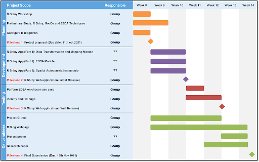
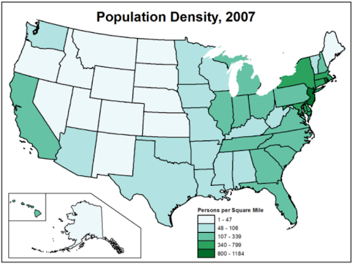
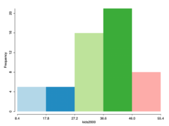
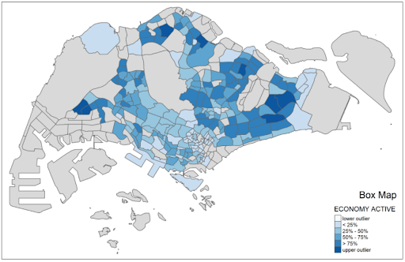

```{r setup, include=FALSE}
knitr::opts_chunk$set(echo = FALSE)
```

# 1. Project Motivation

An important step in data science is to explore and investigate data before proceeding with any modeling, which helps to identify patterns and summarise the main characteristics of the data. The conventional Exploratory Data Analysis (EDA) investigates the relationship between data variables and how they affect each other. In contrast, Exploratory Spatial Data Analysis (ESDA) is nothing but an extension of EDA exploring how a variable correlates to a geographic location. 

It is an important Geographic Information Science (GIS)-based technique that allows users to go beyond mapping to describe and visualise spatial distributions, identify spatial outliers and discover spatial patterns such as clusters or hot spots. This allows users to translate geospatial data into insights by examining the data with a quantitative lens to gain deeper understanding before proceeding on with the modeling.

The most common exploratory areas of the spatial data are as follows:
- Distribution analysis 
- Outliers and Cluster analysis 
- Hot spot and Cold spot Areas analysis

With the latest technological advancements in Unmanned Aerial Vehicles (UAV), remote sensing and the increasing use of GPS-enabled smartphones and devices, the demand for location-based analytics is increasing in every industry with many organisations and multidisciplinary researchers relying on Geospatial Analytics for making decisions and deriving solutions. Therefore, there is a significant demand for free and open-source spatial analysis research infrastructure to enable more users (researchers, students, industry practitioners, non-GIS users) to adopt geospatial analytics and find the value in “where”. 

GeoDa is one such software program built by Professor Luc Anselin and his team which allows users to perform an end-to-end spatial analysis exercise from data transformation, mapping and geovisualisation to ESDA, spatial autocorrelation analysis and finally spatial regression analysis. Therefore, with the objective of building a web-enabled geospatial tool using R statistics tool and packages, our project aims to use GeoDa as reference and translate it into a web-based R shiny application that is easily accessible and user-friendly for all.


# 2. Project Objectives 

1. Build a flexible, robust, user-friendly and web-enabled geospatial tool - GeoXplorer - a geospatial analysis tool created using R Shiny web application hosted on Shinyapp.io with the purpose of allowing users to conduct exploratory spatial data analysis on different use cases

2. Conduct User Acceptance Testing (UAT) of the application by performing exploratory spatial data analysis on a chosen use case to demonstrate the useability of the built application and to identify bugs and areas of improvement

3. Build a R Blog web page using R blogdown hosted on Netlify that showcases our project details and progress as well as three of the final deliverables - poster, final research paper and the application user guide


# 3. Project Scope and Timeline 

```{r, echo = FALSE, fig.align = 'center', out.width = '60%'} 
  
```

# 4. Literature Review

__1. GeoDa: An INtroduction to Spatial Data Analysis__
Authors: Luc Anselin,Ibnu Syabri,Youngihn Kho
Link:  [link](https://doi.org/10.1111/j.0016-7363.2005.00671.x)

__2. Local Indicators of spatial association - LISA__
Authors: Luc Anselin
Link:  [link](https://onlinelibrary.wiley.com/doi/epdf/10.1111/j.1538-4632.1995.tb00338.x)

# 5. Application
## 5.1 Overview

The objective of the application is to allow users from different backgrounds ranging from industry practitioners to students and non-GIS users to be able to use the tool and be able to derive insights from their data. In order to build a comprehensive application, the following categories of functionality will be included to ensure it covers the end-to-end ESDA process:
- Spatial data utility: data input and output, 
- Spatial data manipulation: conversion of the data into suitable format for analysis
- General mapping: visualisation of data
- ESDA: statistical graphics showing the data distribution
- Spatial autocorrelation: global and local spatial autocorrelation statistics with visualization

The table below outlines the functionalities we are aiming to integrate into the application under each of the categories.

```{r, echo = FALSE, fig.align = 'center', out.width = '60%'} 
knitr::include_graphics("table.jpg")  
```

In addition to the functionality, the application would also be evaluated based on the following success measures:  
- User-friendliness of the application interface
- Flexibility and robustness of the application in handling different data
- Quality of the maps and visualisations


## 5.2 Analysis Techniques

The section covers the analytical techniques that will be included in the application.

#### General Mapping

Objectives: 
- Allow users to create commonly used thematic map with different data classification method

**Choropleth Map**: a type of thematic map where colored or shaded areas represent the magnitude of an attribute showing how the spatial distribution of the attribute changes. An important feature of choropleth maps are the data classification used - quantile, equal interval, and custom breaks, which will be given as an option for the users to choose.

```{r, echo = FALSE, fig.align = 'center', out.width = '60%'} 
  
```

**EDA: Univariate Analysis**

Objectives: 
- Allow users to compute and visualise the distribution of a single variable (Histogram, Box plot)
- Allow users to identify outliers of a single variable (Box map)

**Histogram**: Statistical graphic showing the statistics and distribution of a single variable. An important aspect of the histogram is the bin size, and hence will be given as an option for the users to choose.

```{r, echo = FALSE, fig.align = 'center', out.width = '60%'} 
  
```

**Boxplot**: An alternative visualisation of the distribution of a single variable, however it is not able to reveal the spatial distribution of these outliers. An important feature of the box plot is the interquartile range which is a measure of the spread of the distribution, and the outlier detection depends on the multiplier selected for hinges (x1.5 IQR, x3.0 IQR), which will be given as an option for the users to select

```{r, echo = FALSE, fig.align = 'center', out.width = '60%'} 
knitr::include_graphics("boxplot.jpg")  
```

**Box Map**: Extreme value maps are variations of common choropleth maps where the classification is designed to highlight extreme values at the lower and upper end of the scale, with the goal of identifying outliers. One such extreme value map is the box map with custom breaks specification which displays the summary statistics on a choropleth map by using the basic principles of boxplot. Similar to boxplots, the outlier detection depends on the multiplier selected for hinges (x1.5 IQR, x3.0 IQR), which will be given as an option for the users to select

```{r, echo = FALSE, fig.align = 'center', out.width = '60%'} 
  
```

#### Spatial Autocorrelation

**Objectives:**
- Allow users to compute Local Indicator of Spatial Association (LISA) statistics for detecting clusters and outliers
- Allow users to compute Getis-Ord’s Gi-statistics for detecting hot spot or/and cold spot area

**Local Moran's I:** popular spatial statistical method used to identify spatial outliers and clusters, visualised using the Moran scatterplot and LISA cluster map.
- An outlier: significant and negative if location i is associated with relatively low values in surrounding locations.
- A cluster: significant and positive if location i is associated with relatively high values of the surrounding locations.
- In either instance, the p-value for the feature must be small enough for the cluster or outlier to be considered statistically significant.
- The commonly used alpha-values are 0.1, 0.05, 0.01, 0.001 corresponding the 90%, 95, 99% and 99.9% confidence intervals respectively

```{r, echo = FALSE, fig.align = 'center', out.width = '60%'} 
knitr::include_graphics("local moran.jpg")  
```

**Getis-Ord Gi:** spatial statistic called Getis-Ord Gi* statistics are used to identify the hot and cold spots. The analysis consists of three steps - deriving spatial weight matrix, computing Gi* statistics and mapping them. There are two types of spatial weight matrix that can be derived - fixed distance and adaptive distance, both of which will be given as an option for the users. 
- A hot spot area: significant and positive if location i is associated with relatively high values of the surrounding locations.
- A cold spot area: significant and negative if location i is associated with relatively low values in surrounding locations.

## 5.3: Application Prototype

```{r, echo = FALSE, fig.align = 'center', out.width = '60%'} 
knitr::include_graphics("application.jpg")  
```

## 5.4: Application System Architecture

```{r, echo = FALSE, fig.align = 'center', out.width = '60%'} 
knitr::include_graphics("architecture.jpg")  
```


